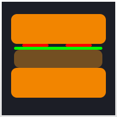
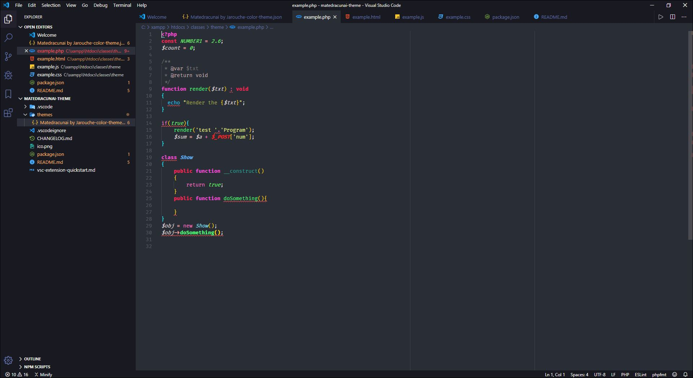

# Matedracunai theme by Jarouche


A A powerfull color theme that mixes materialize, monokai and dracula. Install and feel the power!

## JS sample:


## HTML sample:


## CSS sample:


## PHP sample:



# Recomendations
* Install [Bracket Pair Colorizer](https://marketplace.visualstudio.com/items?itemName=CoenraadS.bracket-pair-colorizer)
  Add this configuration to your settings.json

```
     "bracketPairColorizer.timeOut": 10,
     "bracketPairColorizer.highlightActiveScope": true,
     "bracketPairColorizer.activeScopeCSS": [
     "borderStyle : solid",
     "borderWidth : 1px",
     "borderColor : {color}",
    "outline: 2px solid {color}"
  ],
  "bracketPairColorizer.independentPairColors": [
    [
      "()",
      [
        "#FFD700",
        "#FF00FF",
        "#19F8FF"
      ],
      "#FF0000"
    ],
    [
      "[]",
      [
        "#FFD700",
        "#FF00FF",
        "#19F8FF"
      ],
      "#FF0000"
    ],
    [
      "{}",
      [
        "#19F8FF",
        "#FFD700",
        "#FF00FF",

      ],
      "#FF0000"
    ]
  ],
  "bracketPairColorizer.colorMode": "Independent",
  "bracketPairColorizer.rulerPosition": "Full",
  "bracketPairColorizer.showBracketsInRuler": true

```

* Install [Fira code font](https://github.com/tonsky/FiraCode)
